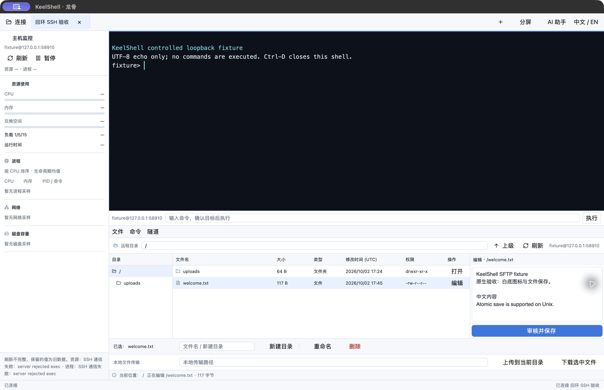
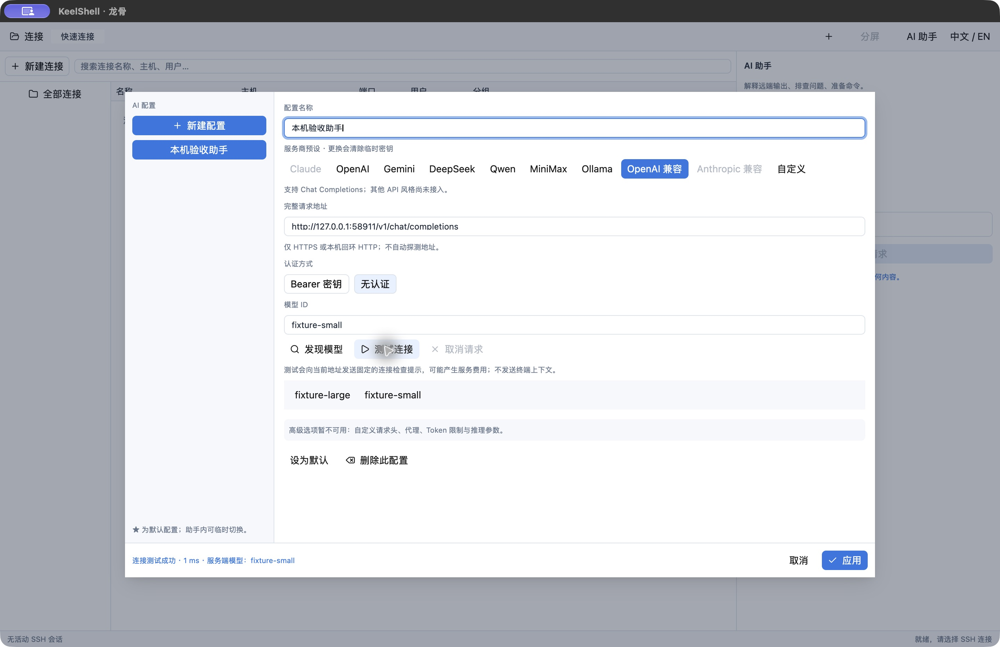

<p align="center">
  
</p>

<h1 align="center">KeelShell</h1>

<p align="center">
  <strong>连接服务器，专注眼前的工作。</strong><br>
  基于 Rust 与 GPUI Kit 的原生 SSH 工作区，将终端、远程文件、主机状态和 AI 助手放在一起。
</p>

<p align="center">
  简体中文 · <a href="README.en.md">English</a>
</p>

<p align="center">
  <a href="https://github.com/cyruss648/keelshell/actions/workflows/ci.yml"></a>
  <a href="https://github.com/cyruss648/keelshell/actions/workflows/release.yml"></a>
</p>

<p align="center">
  <a href="#开始使用">开始使用</a> ·
  <a href="#功能">功能</a> ·
  <a href="#ai由你掌握操作节奏">AI 助手</a> ·
  <a href="docs/README.md">文档</a> ·
  <a href="docs/ROADMAP.md">路线图</a> ·
  <a href="CONTRIBUTING.md">参与贡献</a>
</p>

> **开发预览**：当前建议[从源码运行](#从源码运行)。基础 SSH、SFTP、会话工作区和 AI 审阅流程已实现，传输支持暂停、继续和内容校验续传；已支持原标签手动重连与可选的有界自动重连。功能完成度和验证范围见[能力清单](docs/product/CAPABILITIES.md)。



<p align="center"><sub>macOS 开发版本实机截图，连接本机隔离的 SSH/SFTP 测试服务。界面会随版本迭代。</sub></p>

KeelShell 面向每天需要连接服务器、查看日志和处理远程文件的开发者与运维人员。终端、文件和主机状态跟随当前 SSH 会话，切换标签即可切换工作目标。命令栏持续显示目标，AI 建议经过审阅后再由你执行。

界面默认使用简体中文，可切换英文。项目面向 macOS、Windows 和 Linux，专注远程 SSH 工作流。AI 是可选功能，连接服务器与 SFTP 文件操作均可独立使用。

## 功能

| 工作流 | 当前能力 |
| --- | --- |
| **连接管理** | 无活动会话时可直接进行一次性 SSH 快速连接（不写入连接库），也可显式保存为配置；嵌套文件夹、标签、收藏、最近连接与回收站恢复；搜索、配置编辑/复制、JSON 导入导出和剪贴板 OpenSSH 配置导入（精确 Host、跳板、来源位置与确认审阅）；密码、私钥与 SSH Agent 认证；可在认证时显式切换键盘交互/MFA，逐批提示并只在本次连接中使用回答；最多四个跳板，逐跳核对指纹与认证；每跳可使用 SOCKS5 或 HTTP CONNECT 上游代理 |
| **远程终端** | 多会话标签与双栏分屏，ANSI/VT 终端、滚动区搜索、选择与粘贴，中文输入 |
| **命令效率** | 按会话隔离的命令历史；多行片段与显式变量填写、完整命令预览；本地历史/片段建议，以及显式查询的远端命令与路径补全 |
| **批量命令** | 选择已连接的 SSH 会话，审核命令、逐目标元数据模板（`{{name}}`、`{{host}}`、`{{port}}`、`{{user}}`、`{{endpoint}}`）、并发与超时后独立执行，查看逐目标退出状态和输出，支持失败后停止等待项与取消；完成后保留不含正文、输出和地址的摘要审计 |
| **远程文件** | SFTP 浏览、文件与递归目录上传下载、传输审核、进度、暂停/继续与取消，内容校验后续传文件和目录；失败传输可在同一 SSH 会话中显式发起新的只读续传校验；支持新建目录、重命名、删除、审核式 POSIX 权限修改、文本查看、基于读取基线的本地差异预览和审核保存；文件面板提供有界元数据快照与只读目录比较卡片 |
| **主机状态** | Linux CPU、内存、负载、运行时间、磁盘容量、网络计数、进程列表与监听端口诊断 |
| **端口转发** | 本地/远端 TCP 转发与回环 SOCKS5 代理，显示实际监听地址、运行状态并停止隧道 |
| **AI 助手** | 多个命名服务配置、Chat Completions/Responses/Anthropic Messages 模型发现与连接测试、上下文选择、协议精确请求预览、回答与命令建议；可把回复整理成绑定会话的逐步诊断计划，仍需逐条审核 |
| **关于与更新** | 应用内项目主页、版本与变更日志；按平台检查 GitHub Release、下载并校验 SHA-256，可选安全安装并重启 |

暂停会等待在途操作确认，再显示“已暂停”。需要续传已有部分文件或目录时，手动选择源与目标，审核内容校验结果后继续；重连或重启后可重新创建续传计划。当前验证范围见[传输验收记录](docs/testing/records/2026-10-03-sftp-resume.md)。

断线后保留旧输出与草稿，重连会重新核对整条路线及服务器身份；需要认证时点击继续。旧命令需重新审核，传输和隧道不会自动恢复。[重连设计与验证](docs/testing/records/2026-10-03-reconnection.md)。

在命令栏中点击 **远端补全**，或按 `Ctrl+Space`，可查询光标处的命令名或字面路径。相对路径使用明确显示的补全目录，可取用文件面板目录或 SFTP 起点；选入时填入完整路径。候选只替换当前词，支持多行和中文，确认后再执行。独立查询的 PATH 不包含交互 shell 的别名、函数和临时环境变更；终端自身的 Tab 补全仍可使用。[补全设计与验证](docs/testing/records/2026-10-03-remote-completion.md)。

在片段编辑器中启用变量后，可用 `{{name}}` 定义本次填写的字面值；审核预览再填入命令栏，默认不记录展开后的会话历史。批量任务从已连接的会话中显式选择目标，支持受限的逐目标元数据模板，审核面板会展示每个目标的最终命令，确认后通过独立 SSH exec 执行，不继承交互终端的当前目录。取消不能确认远端进程已停止；摘要审计和差异预览的验证进度见[批量与差异验收记录](docs/testing/records/2026-10-04-batch-audit-diff.md)及[逐目标模板验收记录](docs/testing/records/2026-10-04-reviewed-batch-templates.md)。

## AI，由你掌握操作节奏

1. **配置服务。** 创建命名配置，选择模型，按需发现模型或测试连接。当前支持兼容 Chat Completions、Responses 和 Anthropic Messages 的接口，包括自建服务；Anthropic 请求使用 x-api-key 和人工可审阅的 Messages 预览。
2. **选择上下文。** 选取终端内容，检查脱敏后的实际请求，再手动发送。
3. **审阅建议。** 阅读回答，将需要的命令填入命令栏，确认内容和目标后执行。

AI 密钥默认仅保存在内存中，也可显式加密保存。保存和解锁配置本身不会联网。更多协议与辅助工作流见[路线图](docs/ROADMAP.md)。

<details>
<summary>查看 AI 配置界面</summary>



截图使用本机模拟服务，不包含真实服务凭据。

</details>

<details>
<summary>凭据如何保存</summary>

SSH 密码和私钥口令默认仅用于当次连接。代理用户名可保存在连接配置中，代理密码只用于当次连接。主动保存 SSH 凭据时，它们进入主密码加密的本机凭据库，每次连接都需重新解锁。解除关联只移除连接引用，加密条目仍保留在凭据库中；可以检查、清理未关联条目，也可以轮换主密码。

AI 密钥显式保存后，重启需要用主密码解锁，再应用到助手。修改服务地址会清除旧密钥关联。连接配置的 JSON 导出不包含本机凭据引用或主机信任记录。

</details>

## 开始使用

当前建议从源码运行。版本构建将发布在 [GitHub Releases](https://github.com/cyruss648/keelshell/releases)，每个下载包附带 SHA-256 校验值。

运行中的应用可从工具栏打开 **关于/更新**，查看随应用提供的变更日志，手动检查新版本并下载当前平台的发布包。下载只会写入私有临时目录并验证发布页提供的 SHA-256；点击“自动安装并重启”后，独立助手会再次校验发布清单，只替换清单中的文件，并在失败时回滚。开发构建或没有标准安装目录时，面板会保留查看和手动安装选项；签名、公证、系统权限和各平台真实安装验收仍需在对应发行环境完成。

| 平台 | 构建目标 | 包格式 |
| --- | --- | --- |
| macOS 15+ | Apple Silicon / Intel | `.app` 的 ZIP 包 |
| Windows | ARM64 / x64 | EXE 与图标的 ZIP 包 |
| Linux | ARM64 / x64，Ubuntu 24.04 基线 | 包含程序与桌面资源的 `.tar.gz` |

各平台实际构建与桌面验收状态见 [发布记录](docs/testing/records/2026-10-03-release.md)。当前分发流程尚未接入 macOS 签名、公证或 Windows 代码签名。构建、打包与标签发布步骤见 [发布说明](docs/RELEASING.md)。

### 从源码运行

先准备 [平台构建依赖](.github/actions/setup-build/action.yml)，安装 Rust 工具链管理器和 Python 3.11+。仓库的 `rust-toolchain.toml` 会选择锁定的 Rust 版本。

```sh
git clone https://github.com/cyruss648/keelshell.git
cd keelshell
cargo run -p keelshell-app --locked
```

使用 [mise](https://mise.jdx.dev/) 管理工具链时，可在仓库内执行 `mise install`。

### 第一次连接

1. 无活动会话时，可在首页的 **快速连接** 中填写服务器地址、端口和用户名，直接开始一次性 SSH 会话；需要复用配置时点击 **保存为连接…**，再在连接编辑器中明确保存。已有连接配置仍可从下方连接库或 **新建连接** 管理持久化配置。
2. 发起连接，与可信来源核对服务器指纹后确认信任。已保存指纹发生变化时，连接会被阻止并要求重新核对。
3. 在会话标签中使用远程终端和文件面板；连接 Linux 主机时，可查看主机状态。需要 AI 协助时，再配置服务与模型。

已有 OpenSSH 配置时，复制文本后点击 **导入 SSH 配置**。导入器只接受精确 Host、HostName、Port、User、IdentityFile、ProxyJump 和显式 Include 内容；通配、条件和 ProxyCommand 会显示为需要审阅的警告，不会执行配置中的命令。

## 项目文档

| 想了解什么 | 从这里开始 |
| --- | --- |
| 哪些功能已经可用，还有哪些限制 | [能力清单](docs/product/CAPABILITIES.md) |
| 产品场景、交互规则与后续计划 | [产品设计](docs/product/PRODUCT.md) · [开发路线](docs/ROADMAP.md) |
| 工程结构、本地开发和检查命令 | [贡献指南](CONTRIBUTING.md) |
| 测试如何覆盖行为，哪些平台已验证 | [测试策略](docs/testing/STRATEGY.md) · [测试记录](docs/testing/records/) |
| 平台包、校验值和标签发布流程 | [发布说明](docs/RELEASING.md) |

## 参与贡献

欢迎通过 [Issues](https://github.com/cyruss648/keelshell/issues) 报告问题、分享使用体验和提出功能建议。复现步骤、匿名配置和平台验证结果都很有帮助。代码与文档贡献请从[贡献指南](CONTRIBUTING.md)开始。

## 致谢

KeelShell 构建于 [Rust](https://www.rust-lang.org/)、[GPUI Kit](https://gpui-kit.com/)、[Alacritty](https://github.com/alacritty/alacritty)、[russh](https://github.com/Eugeny/russh) 等项目之上。感谢这些项目及其贡献者。
