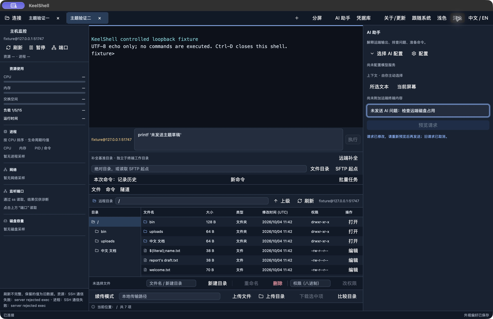
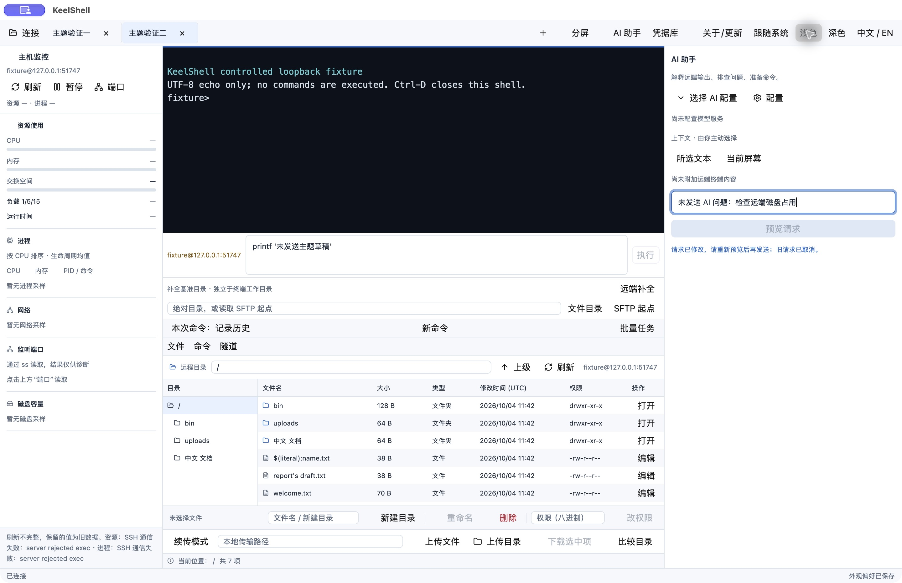

# Application appearance

Implemented foundation, 2026-10-04. The toolbar provides System, Light and Dark;
new preferences follow System. Existing saved Light/Dark are preserved. Theme
selection changes application controls and native chrome while terminal ANSI
content keeps its own palette. Behavior and native evidence are recorded in
[ADR 0036](../adr/0036-system-appearance-and-semantic-palette.md) and the
[verification record](../testing/records/2026-10-04-system-themes.md).

## Semantic colors

`crates/keelshell-app/src/design.rs` is authoritative. Components take a copied
palette from the active toolkit mode at render time; new views must not cache a
light palette or introduce fixed light backgrounds.

| Role | Light | Dark | Use |
| --- | --- | --- | --- |
| Canvas | `#f6f8fb` | `#101927` | Workspace and secondary layers |
| Surface | `#ffffff` | `#172231` | Forms, panels and modal body |
| Border | `#dce3ec` | `#34465b` | Group boundaries and fields |
| Text | `#1d2939` | `#e5edf6` | Main labels and values |
| Secondary text | `#5d6c80` | `#a0afc0` | Hints and metadata |
| Accent | `#2166c5` | `#83b6ff` | Links, focus and active cues |
| Selected | `#e8f1ff` | `#223e5b` | Selected rows/tabs |
| Primary | `#2166c5` | `#316fca` | Explicit primary actions, white labels |
| Success | `#187445` | `#76d5a1` | Proven successful status with text/icon |
| Warning | `#805500` | `#efc176` | Review and uncertain outcomes with wording |
| Danger | `#b32638` | `#ff97a6` | Failure/destructive actions with wording |

Hover/active primary states and danger surfaces/borders are defined beside these
tokens. Contrast tests require at least 4.5:1 for ordinary text/secondary/accent
on supported layers, white primary labels and status text on its declared
surface. This does not prove every rendered state or accessibility compliance.
Disabled controls use toolkit states and remain subject to native review.

Base text is 14 px; use existing compact toolbar density, 6 px control corners
and 12 px major floating surfaces. Keep one brand accent and reserve semantic
colors for meaning. Show a label/icon as well as color for success, failure,
unknown, cancellation and review. Exact command/context/target review takes
priority over decorative effects.

## Native working baseline

These exact macOS captures use the final binary hash in the verification record,
isolated state and controlled echo-only SSH/SFTP. They are appearance evidence;
the visible monitor refusal is expected from this fixture.

## Remaining design work

The foundation is not the complete visual refresh. Continue with grouped toolbar
actions, consistent badges, progress/rate cards, adaptive file actions and modal
keyboard/AX isolation. Current native screenshots show an English SFTP footer
clipping its final action with the AI sidebar at a 1440 px workspace. An open
tooltip can retain the previous language until hover changes. Keep these issues
in the next responsive/localization review. All major forms, terminal search/CJK,
900×580 native windows and Windows/Linux native themes still need their matrix.
